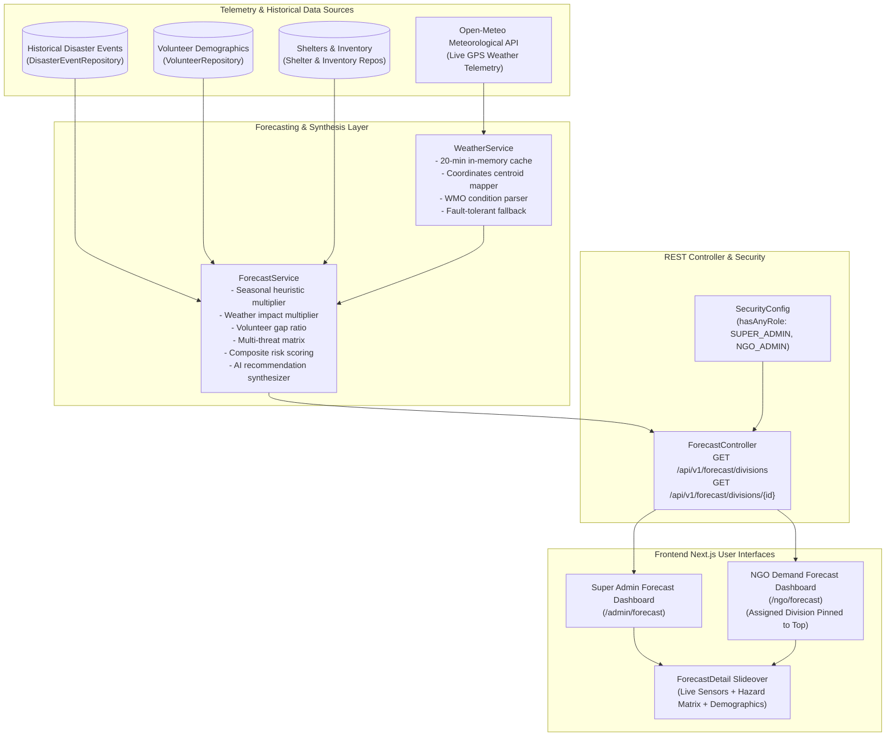

# Predictive Demand Forecasting & Meteorological Risk Engine

This document provides a comprehensive technical overview of the **Predictive Demand Forecasting** system implemented in Nexora. It explains the design principles, mathematical formulation, real-time meteorological integration, data model, role-based workflows, and operational architecture.

---

## 1. Executive Summary

Disaster response operations frequently suffer from catastrophic mobilization bottlenecks: by the time an emergency is officially declared, relief supplies and certified personnel are already logistically constrained or stranded.

The **Predictive Demand Forecasting Engine** addresses this challenge by proactively analyzing:
1. **Historical Disaster Data**: Past event frequencies, severity distributions, and realized volunteer participation.
2. **Real-Time Weather Feeds**: Live meteorological observations (precipitation, wind velocity, ambient heat, humidity) sourced from the Open-Meteo REST API.
3. **Territorial Seasonality**: Bangladesh-specific hazard calendars (monsoon flooding, pre/post-monsoon cyclones, dry-season urban fires, and tectonic faultlines).
4. **Demographic Volunteer & Resource Density**: Local active responder pools, active deployments, certified skill distributions, and operational shelter/inventory reserves.

The system synthesizes these inputs into normalized risk indices (0.0 to 1.0), projects numerical volunteer surge requirements, and delivers natural-language action recommendations to disaster managers before bottlenecks occur.

---

## 2. System Architecture



---

## 3. The Multi-Factor Scoring Model (Mathematics & Engine)

For each administrative division \( d \) and disaster threat vector \( t \) (\(\text{FLOOD}, \text{CYCLONE}, \text{FIRE}, \text{EARTHQUAKE}, \text{PANDEMIC}\)), the system calculates a multi-dimensional composite risk score:

$$\text{RiskScore}(d, t) = W_{hist} \cdot \bar{F}_{hist} + W_{sev} \cdot \bar{S}_{sev} + W_{season} \cdot \bar{M}_{season} + W_{weather} \cdot \bar{M}_{weather} + W_{gap} \cdot R_{gap}$$

### Parameter Weights:
| Weight | Factor | Value | Rationale |
|---|---|---|---|
| \( W_{hist} \) | Historical Disaster Frequency | **0.25** | Prior empirical occurrence within this territorial boundary |
| \( W_{sev} \) | Average Historical Severity | **0.20** | Weight of catastrophic impact (LOW=1.0 to CRITICAL=4.0) |
| \( W_{season} \) | Bangladesh Seasonal Multiplier | **0.20** | Temporal hazard alignment (Monsoon, Cyclone cycle, Dry season) |
| \( W_{weather} \) | Live Weather Telemetry Factor | **0.20** | Current ground conditions (rainfall rate, wind speed, heat index) |
| \( W_{gap} \) | Volunteer Deficit Ratio | **0.15** | Historical shortfall between requested volunteers vs actual participants |

### Normalization Mechanics:
1. **Normalized Frequency (\( \bar{F}_{hist} \))**:
   $$\bar{F}_{hist} = \min\left(1.0, \frac{\text{Count}(events_{d, t})}{6.0}\right)$$
   Territories with 6 or more historical events of that type reach full historical weight.

2. **Normalized Severity (\( \bar{S}_{sev} \))**:
   $$\bar{S}_{sev} = \frac{\bar{S}_{raw} - 1.0}{3.0} \quad \text{where } \bar{S}_{raw} \in [1.0, 4.0]$$

3. **Normalized Seasonality (\( \bar{M}_{season} \))**:
   $$\bar{M}_{season} = \min\left(1.0, \frac{M_{season} - 0.70}{1.30}\right)$$

4. **Normalized Weather (\( \bar{M}_{weather} \))**:
   $$\bar{M}_{weather} = \min\left(1.0, \frac{M_{weather} - 0.80}{1.20}\right)$$

5. **Volunteer Gap Deficit Ratio (\( R_{gap} \))**:
   $$R_{gap} = \frac{\sum \max(0, \text{Required} - \text{Joined})}{\sum \text{Required}}$$
   If the local available active volunteer count is less than 15 responders, an automatic penalty factor (\(+0.25\)) is applied to account for regional demographic scarcity.

### Risk Level Categorization:
- **CRITICAL**: \( \text{RiskScore} \ge 0.70 \) (Immediate pre-positioning and inter-divisional surge required)
- **HIGH**: \( 0.50 \le \text{RiskScore} < 0.70 \) (Heightened mobilization and readiness checks)
- **MODERATE**: \( 0.30 \le \text{RiskScore} < 0.50 \) (Standard situational monitoring and logistics check)
- **LOW**: \( \text{RiskScore} < 0.30 \) (Routine operations)

### Predicted Personnel Demand Formula:
$$\text{Demand}_{predicted}(d, t) = \text{BaseDemand}(t) \times \left(1.0 + \text{RiskScore}(d, t)\right) \times \left(1.25 \text{ if peak season else } 1.0\right)$$

Baseline demands:
- **CYCLONE**: 55 responders
- **EARTHQUAKE**: 65 responders
- **FLOOD**: 40 responders
- **PANDEMIC**: 35 responders
- **FIRE**: 30 responders

---

## 4. Real-Time Weather Integration (Open-Meteo Engine)

### 4.1 Zero-Credential Live Weather Ingestion
The platform utilizes Open-Meteo's open meteorological service. Each division is mapped to its administrative centroid coordinates:

| Division | Centroid Latitude | Centroid Longitude | Geographic Risk Characteristics |
|---|---|---|---|
| **Dhaka** | 23.8103° N | 90.4125° E | Dense urban fire risk, moderate flood plains |
| **Chattogram** | 22.3569° N | 91.7832° E | Coastal storm surge, cyclone strikes, flash landslides |
| **Rajshahi** | 24.3745° N | 88.6042° E | Summer heatwaves, drought, river erosion |
| **Khulna** | 22.8456° N | 89.5403° E | Coastal cyclones, saline inundation, Sundarbans surges |
| **Barishal** | 22.7010° N | 90.3535° E | Deltaic tidal surges, cyclone landfall corridors |
| **Sylhet** | 24.8949° N | 91.8687° E | Transboundary flash floods (Surma/Kushiyara), tectonic faultlines |
| **Rangpur** | 25.7439° N | 89.2752° E | Monsoon Teesta/Brahmaputra flash flooding, winter cold waves |
| **Mymensingh** | 24.7471° N | 90.4203° E | Flash floods from Garo hills, river overflow |

### 4.2 Dynamic Weather Multiplier Logic
```java
// Sourced from ForecastService.java:
switch (type) {
    case FLOOD -> {
        if (weather.precipitation() > 25.0) multiplier += 0.50; // Torrential rainfall
        else if (weather.precipitation() > 10.0) multiplier += 0.30;
        else if (weather.precipitation() > 0.0) multiplier += 0.15;
    }
    case CYCLONE -> {
        if (weather.windSpeed() > 50.0) multiplier += 0.60; // Gale force
        else if (weather.windSpeed() > 30.0) multiplier += 0.35;
        else if (weather.windSpeed() > 20.0) multiplier += 0.15;
    }
    case FIRE -> {
        if (weather.temperature() > 37.0 && weather.relativeHumidity() < 45) multiplier += 0.45; // High thermal dry index
        else if (weather.temperature() > 34.0) multiplier += 0.20;
    }
}
```

### 4.3 Resilience & In-Memory Caching
To prevent third-party rate limiting or network failures from degrading platform performance:
- Weather telemetry is cached in memory per division using a concurrent map with a **20-minute Time-To-Live (TTL)**.
- If external calls fail (e.g. timeout or no internet), the system falls back seamlessly to the last cached reading or a regionally calibrated seasonal default without throwing errors.

---

## 5. Bangladesh Seasonal Disaster Calendar

The forecasting service embeds geographical knowledge regarding Bangladesh's seasonal weather patterns:

1. **Monsoon Flood Season (June – September)**:
   - Multiplier elevated to **1.70x – 1.95x**.
   - Higher vulnerability assigned to flash-flood-prone zones: **Sylhet**, **Rangpur**, and **Mymensingh**.
2. **Tropical Cyclone Seasons (April–May & October–November)**:
   - Coastal divisions (**Chattogram**, **Barishal**, **Khulna**) receive a peak seasonal multiplier of up to **1.90x**.
3. **Dry & Urban Fire Season (March – May)**:
   - Densely populated industrial and urban areas (**Dhaka**, **Chattogram**) receive elevated fire multipliers (**1.50x – 1.75x**).
4. **Tectonic Faultline Vulnerability**:
   - The Dauki fault and northeastern active boundary elevate seismic readiness scores (**1.35x**) for **Sylhet** and **Chattogram**.

---

## 6. Demographic Supply & Field Operations Telemetry

To identify volunteer bottlenecks, the engine tracks local capacity:
- **Active Ready Volunteers**: Filtered by division ID and status `ACTIVE`.
- **Currently Deployed Personnel**: Distinct active volunteers participating in `OPEN` or `ONGOING` events in that division.
- **Net Available Volunteers**:
  $$\text{Available} = \max(0, \text{Active} - \text{Deployed})$$
- **Regional Skill Extraction**: Aggregates top skills registered by local volunteers (e.g., *Medical / First Aid*, *Boat Rescue*, *Logistics Coordination*, *Search & Rescue*).
- **Shelter & Inventory Readiness**: Summarizes platform-wide open shelters, available beds, and low-stock inventory alerts.

---

## 7. Role-Based User Experiences

### 7.1 Super Admin Command Center (`/admin/forecast`)
- **National Overview**: Real-time summary cards displaying total monitored territories, critical alerts, projected national personnel demand, and ready responders.
- **Meteorological Status Banner**: Real-time indicator showing active weather multipliers.
- **8-Division Matrix**: All divisions ranked by composite risk score descending.
- **Detailed Threat Inspection Modal**: In-depth breakdown per disaster vector with AI dispatch recommendations.

### 7.2 Humanitarian NGO Command Center (`/ngo/forecast`)
- **Country-Wide Scope**: NGO directors can inspect conditions throughout all 8 divisions.
- **Territory Priority Focus**: The NGO's registered home division is **pinned to the very top** with a distinct highlighted amber border and badge (`"Your Division • Priority Focus"`).
- **Operational Directive**: Suggests specific mobilization targets based on local volunteer readiness and resource buffers.

---

## 8. REST API Reference

### 8.1 National Forecasts
```http
GET /api/v1/forecast/divisions
Authorization: Bearer <JWT>
```
**Access**: `ROLE_SUPER_ADMIN`, `ROLE_NGO_ADMIN`

**Response Example (200 OK)**:
```json
{
  "success": true,
  "data": [
    {
      "divisionId": 6,
      "divisionName": "Sylhet",
      "divisionBnName": "সিলেট",
      "overallRiskLevel": "CRITICAL",
      "overallRiskScore": 0.78,
      "predictedVolunteersNeeded": 58,
      "primaryThreat": "FLOOD",
      "isUserDivision": true,
      "weather": {
        "temperature": 27.4,
        "precipitation": 18.2,
        "windSpeed": 14.1,
        "relativeHumidity": 88,
        "weatherCode": 80,
        "condition": "Heavy Rain Showers",
        "fetchedAt": "2026-09-23T13:20:00Z"
      },
      "volunteerSupply": {
        "activeVolunteers": 34,
        "currentlyDeployed": 8,
        "availableVolunteers": 26,
        "topSkills": ["Boat Rescue", "First Aid", "Water Sanitation"]
      },
      "resources": {
        "totalShelters": 6,
        "openShelters": 4,
        "availableBeds": 180,
        "totalInventoryItems": 24,
        "lowStockItems": 2
      },
      "risks": [
        {
          "eventType": "FLOOD",
          "eventTypeName": "Flash & River Flood",
          "riskScore": 0.78,
          "riskLevel": "CRITICAL",
          "historicalEventCount": 4,
          "avgSeverity": 3.2,
          "seasonalMultiplier": 1.95,
          "weatherMultiplier": 1.30,
          "volunteerGapRatio": 0.42,
          "predictedVolunteersNeeded": 58,
          "summaryReason": "High precipitation (18.2mm). Current calendar month is peak seasonal hazard window."
        }
      ],
      "recommendation": "High flood preparedness alert for Sylhet. Live precipitation is 18.2 mm (Heavy Rain Showers). Pre-stage rescue boats, emergency dry rations, and water purification units. Mobilize an additional 32 certified volunteers from neighboring divisions."
    }
  ]
}
```

### 8.2 Single Division In-Depth Forecast
```http
GET /api/v1/forecast/divisions/{divisionId}
Authorization: Bearer <JWT>
```
**Access**: `ROLE_SUPER_ADMIN`, `ROLE_NGO_ADMIN`

---

## 9. Verification & Testing

1. **Compile Backend**:
   ```bash
   cd Nexora
   mvn test-compile
   ```
2. **Run Spring Boot Unit & Integration Tests**:
   ```bash
   mvn test
   ```
3. **Build Frontend**:
   ```bash
   cd frontend
   npm run build
   ```
4. **Interactive Verification**:
   - Log in as **Super Admin** (`admin@nexora.bd` / `Admin@12345`) and navigate to `/admin/forecast`.
   - Verify all 8 divisions are listed with live weather readings and risk indices.
   - Click any card to inspect the threat matrix modal.
   - Log in as an **NGO Admin** and navigate to `/ngo/forecast`.
   - Verify all 8 divisions appear, with the NGO's registered division pinned to the top as the priority territory.

